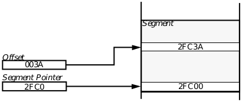
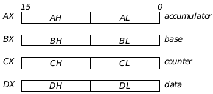

Table A-0

## A Machine Architecture

The GEOS operating system is state-of-the art technology based on the 
Intel 80x86 microprocessor. This chapter discusses some of the elements of 
the 80x86 design and history.

Those unfamiliar with the 8086 architecture would do well not only to read 
this overview but also to pick up a book about the Intel chip series. There 
are dozens of good books about the 80x86 chips, and this section provides 
only a brief review.

### A.1 History of the 80x86

The commercial microcomputer essentially began with Intel's introduction 
of the 8008 chip in 1972. This was an 8-bit machine that eventually led to 
the 8080 (in 1974), which was the precursor to the processors that now 
provide the power of today's PCs.

The 8080 was an 8-bit processor that used seven general-purpose registers 
and an external 8-bit bus. It addressed 64K of memory; such a small 
memory space necessitated optimization of each instruction in an attempt 
to keep as many instructions as possible under one byte in length. This 
optimization resulted in many instructions being forced to work on specific 
registers; for example, most arithmetic and logical operations used the 
accumulator as the destination register.

In 1978, the 8086 followed, bringing 16-bit architecture to microcomputers. 
The designers of this new chip, however, wanted to aid in quick software 
development, so they gave the 8086 an instruction set and architecture 
reminiscent of the 8080-this allowed software based on the earlier chip to 
be ported to the new hardware quickly and cheaply. The 8086 offered 
significant advances, most notably the ability to access up to one megabyte 
of memory in 64K segments.

A year later, in 1979, the 8088 was introduced. This chip had all the 
advanced features of the 16-bit 8086 except one: Rather than using a 16-bit 
external data bus, the 8088 used the same 8-bit bus used in the 8080. This 
step backwards made it possible for systems and peripherals designed for 
use with the 8080 to be used with a faster, more powerful chip. The 8088 
was built into IBM's personal computers for just this reason.

Both the 8088 and the 8086 can run the same software; they use the same 
instruction set. However, the power of the data processing offered by the 
8086 eventually won out as systems and software became more complex.

### A.2 8086 Architecture Overview

The 8086 uses a 16-bit architecture but can handle 8-bit data as well. It 
accesses up to one megabyte (1024K) of memory, sixteen times more than 
the 8-bit 8080 could. It has thirteen registers (each 16 bits) plus a status 
register containing nine flags.

#### A.2.1 Memory

The memory of the 8086 begins at hexadecimal address 0x00000 and 
continues (each increment representing one byte) to hexadecimal address 
0xFFFFF. Any two consecutive bytes constitute a word. The address of a 
word is the same as the address of its low byte (see Figure A-1).

  
**Figure A-1** Structure of a Word  
_A word consists of two bytes, the high byte having the higher address._

Both the 8088 and 8086 have instructions that access and manipulate 
words, and both have instructions that access and manipulate bytes. The 
8088, however, always fetches a single byte from memory due to its 8-bit 
bus. The 8086 always fetches two bytes, or a word; if the instruction only 
operates on a byte, the excess 8 bits will be ignored. This information may 
be useful to assembly programmers who wish to optimize the performance 
of their code, but C programmers can ignore it.

As stated earlier, the 8086 can access up to one megabyte of memory. This 
translates to 220 bytes, or 220 addresses. However, because the 8086 is 
designed to do 16-bit arithmetic, it can not directly access all that memory. 
Instead, an additional mechanism, known as segmentation, is employed.

A segment is a contiguous set of bytes no larger than 64K (216 bytes). It 
must begin on a paragraph boundary (a paragraph is a contiguous block of 
16 bytes, the first of which has an address divisible by 16-that is, its 
address must have zeros for its four least significant bits). This allows the 
processor to use just 16 bits (leaving off the four zero bits) to access the first 
byte of a given segment.

To access bytes further into a segment, instructions use not only the 16-bit 
segment pointer but also a 16-bit offset. Combined, the segment pointer 
and offset can specify any byte in memory. (See Figure A-2 for an 
illustration of accessing a segment.)

  
**Figure A-2** Accessing a Byte in a Segment  
_Each byte is accessed via a segment pointer and an offset. Note that all 
addresses shown are in hexadecimal._

Segments may be any size up to 64K. There is no way to specify the exact 
size of a segment; the processor does not police memory access. Segments 
may obviously overlap; it is possible, for example, to have two different 
segments begin 16 bytes apart. Since segments can be any size up to 64K, 
the two in this example may well overlap.

The addressing mode described above is used in the 8088 and 8086, a large 
portion of the GEOS market. However, later processors such as the 80386 
also employ a protected mode of memory access, in which each process 
running is relegated a given portion of memory and memory access is 
policed by the processor. These later processors also can use the segmented 
mode of the 8086; however, because GEOS applications should be able to 
run on an 8086 or 8088 machine, they should adhere to the 8086 rules.

#### A.2.2 Registers

The Intel 80x86 processors have thirteen registers plus one register 
containing machine status flags. The thirteen registers are separated into 
four logical groups by their use (they are all 16 bits):

+ Instruction Pointer  
This single register maintains the address of the current instruction 
being executed. This is not accessed by applications.

+ Segment Registers  
These four registers contain segment pointers.

+ Index and Pointer Registers  
These four registers contain offsets into segments.

+ General registers  
These four registers can contain any general data. They may be 
operated on as words or bytes.

The Segment and Index registers are used in conjunction to access memory. 
A program may have four segments pointed to at once: A code segment 
(CS), a data segment (DS), a stack segment (SS), and an extra segment (ES). 
These segments have various uses and purposes described in most 
8088/8086 books.

The four Index registers are used as offsets into the segments pointed to in 
the Segment registers. They are the Stack Pointer (SP), the Base Pointer 
(BP), the Source Index (SI), and the Destination Index (DI). Each of these 
index registers has special applications with certain instructions.

The General registers are four 16-bit registers that may be used for any 
purpose. However, due to the early restrictions of the 8080 that carried 
over into the later processors, some instructions place their results or take 
their source data from specific registers.

All four general registers may be accessed as a word or as two separate 
bytes. The four registers are AX (the accumulator), BX (the base register), 
CX (the counter), and DX (the data register). The high byte of any of these 
may be accessed by substituting "H" for "X," and the low byte may be 
accessed by substituting "L" for "X." (The "H" stands for "high" and the "L" 
for "low.") Figure A-3 shows a diagram of these four registers.

  
**Figure A-3** The Four General Registers  
_The four general registers of the 8088 and 8086 can be accessed either as entire 
words or as separate bytes._

#### A.2.3 The Prefetch Queue

Programmers who code in assembly language should be familiar with how 
the 8086 fetches data and instructions from memory. Good programmers 
can take advantage of the more efficient instructions to cut down on 
processor time for given operations.

The 8086 takes four clock cycles to fetch a single word from memory. To 
speed up instruction processing, the 8086 has a prefetch queue, a buffer of 
six bytes into which pending instructions are put. The 8086 is also broken 
into two separate processing units: The Execution Unit executes 
instructions while the Bus Interface Unit (BIU) fetches pending 
instructions and stuffs them into the prefetch queue.

The main goal of this separation is to make as much use of the bus as 
possible, even when an instruction that does not access memory is being 
executed. For example, if an instruction takes eight cycles to execute and 
does not access memory, the BIU could meanwhile fill four instructions into 
the prefetch queue. Therefore, while slow instructions are still slow, the 
instructions after them appear to be quicker.

However, jump and branch instructions negate this prefetch effect. When 
a branch or jump is executed, the prefetch queue is flushed and must again 
be filled.

#### A.2.4 Inherent Optimizations

The 8088 and 8086 instruction set was designed with many instructions 
manifested in two different forms: one that allowed a wide range of possible 
arguments, and another that worked with one of the arguments 
prespecified. Since the second form did not have to load both arguments 
from memory, those instructions were shorter than their counterparts.

For example, the instruction and has these two forms: "And with 
anything," which assembles into three bytes of machine code, and "And 
with AX or AL," which assembles into only two bytes of machine code. Thus, 
the instruction and al, ffh is more efficient than and bl, ffh.

Another optimization occurs in the set of string instructions. A string is 
simply a set of consecutive bytes or words in memory. To repeat an 
operation on each element of the string could normally take a long time due 
to branching and checking for final conditions (branching clears out the 
prefetch queue). However, the string operations act as single, 
nonbranching instructions, so the prefetch queue is not affected by them. 
This speeds up string operations considerably.

[Drawing Graphics](cshapes.md) <-- &nbsp;&nbsp; [table of contents](../concepts.md) &nbsp;&nbsp; --> [Threads and Semaphores](cmultit.md)
